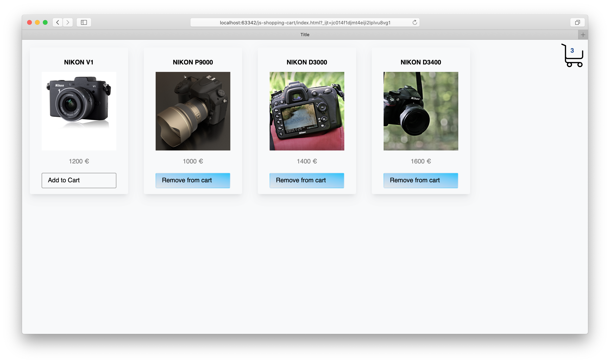
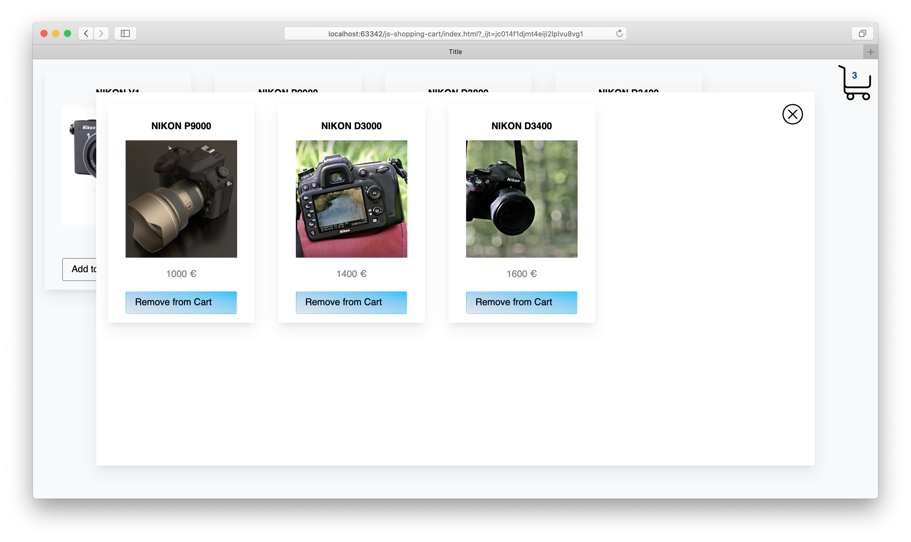
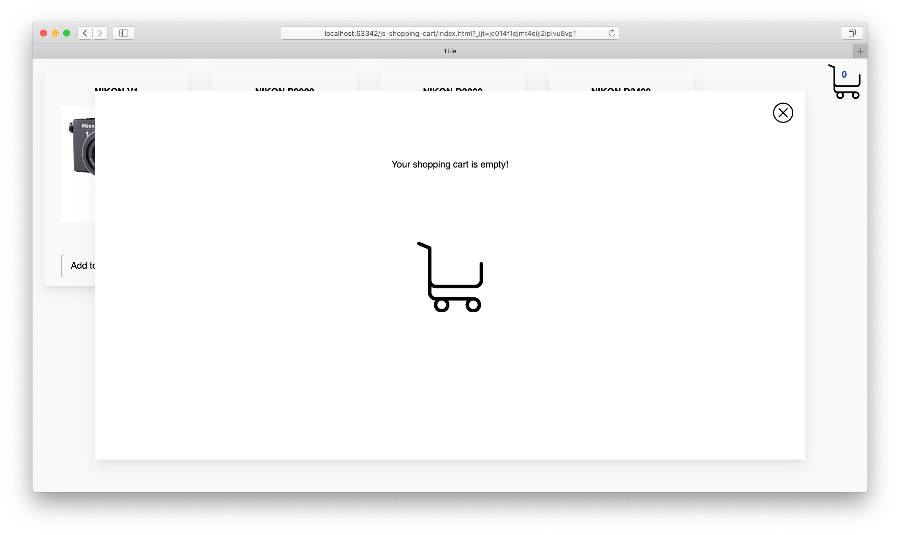

# JavaScript shopping cart

En example of implementation a shopping cart for the Online Store on vanilla JavaScript and CSS.

Based on [Web Panda](https://www.youtube.com/watch?v=wsJbCvHkaKU) JavaScript video practices.

#### Demo:
The project was published on Netlify demo page https://tender-minsky-fa17f8.netlify.com/ 
#### Screenshots:

